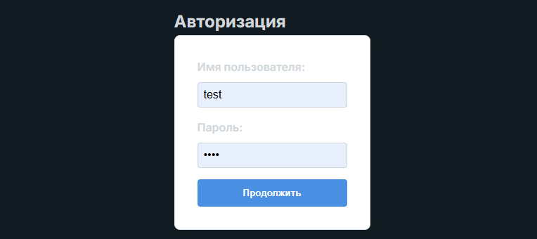
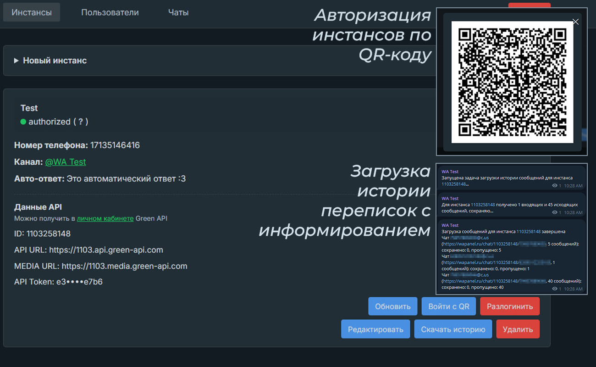
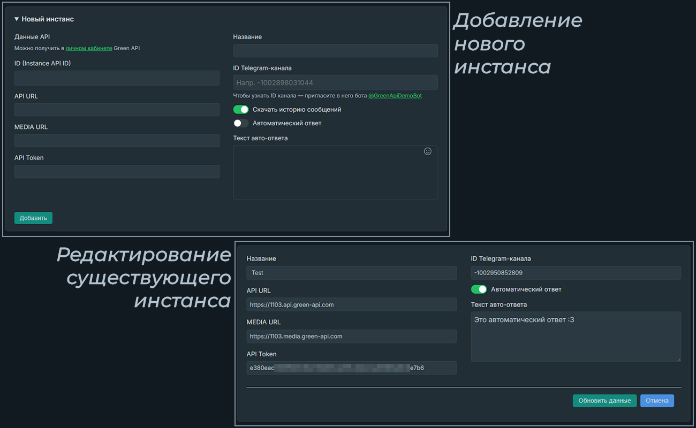
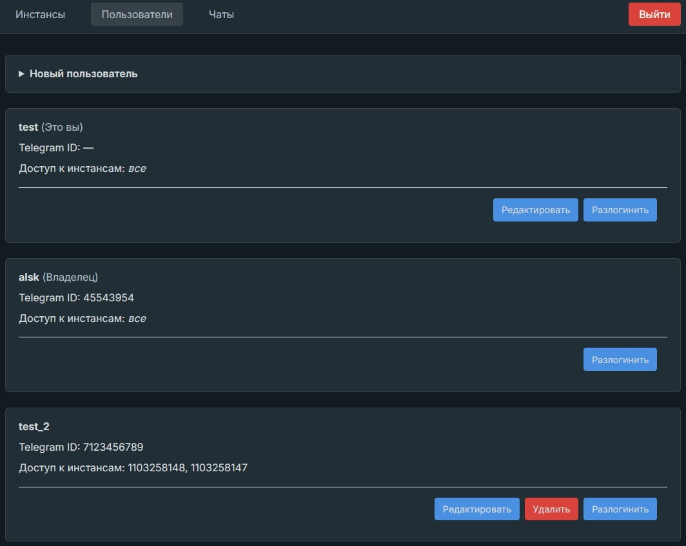
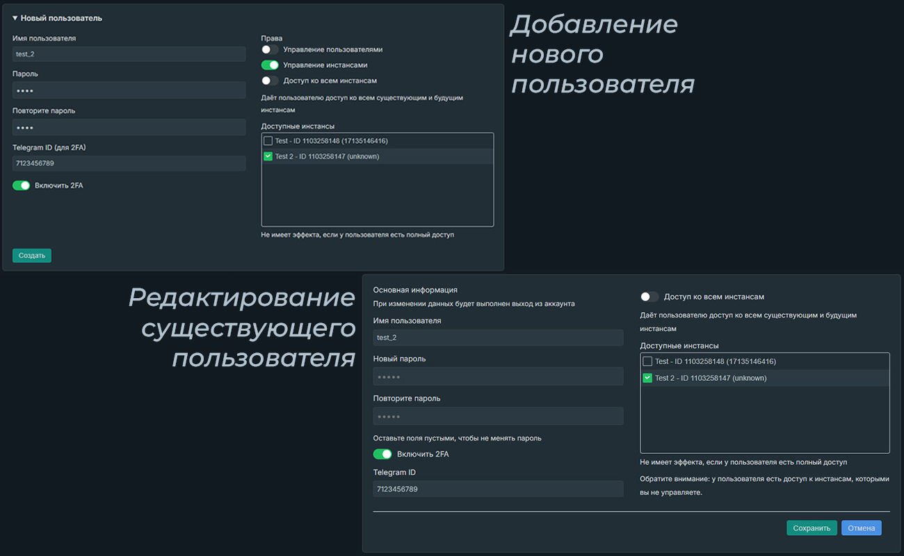
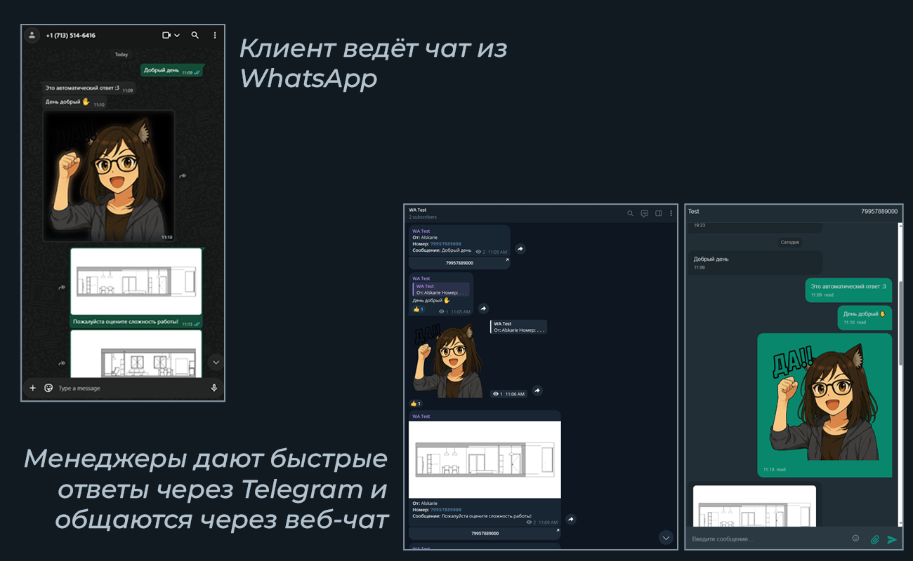
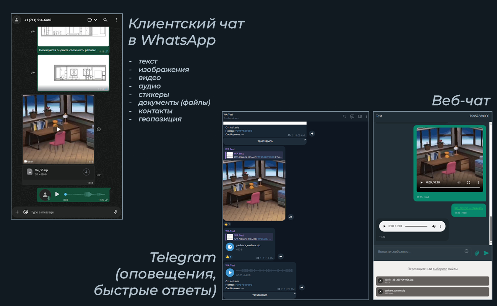

# GreenConnect (WAPanel)


Чат-платформа для работы с клиентами WhatsApp через веб-интерфейс и Telegram. Взаимодействие с WhatsApp за счёт интеграции с Green-API (https://green-api.com/). 

- **Агрегация сообщений**: входящие со всех инстансов WhatsApp попадают в единую систему и маршрутизируются в веб-чат и связанный Telegram-канал с мгновенными уведомлениями и reply-ответами
- **Командная работа без ограничений WhatsApp Web**: на одном инстансе одновременно может работать более 4-х менеджеров
- **Контроль и безопасность**: система прав пользователей (функциональные и ограничение доступных инстансов), серверные сессии, HTTPS, бэкапы БД и ротация логов
- **Админ-панель полностью адаптирована под мобильные устройства**, мобильный функционал протестирован

### Авторизация

- Серверные сессии на стороне БД
- Опциональная 2FA (двухфакторная аутентификация) через Telegram-бот
- Возможность инвалидировать сессии пользователя (разлогинить на всех устройствах)

### Инстансы
[](_media/inst-0.png)
[](_media/inst-1.png)
- Подключение и управление инстансами Green-API, выбор Telegram-канала для уведомлений и быстрых ответов
- Авторизация инстанса в аккаунте WhatsApp путем сканирования QR-кода (генерируется и обновляется автоматически)
- Загрузка истории переписок (чаты персистентны на уровне инстанса: при смене номера они остаются доступными, пока используется тот же инстанс; чаты с другого номера дополняют историю)
- Возможность установить автоматический ответ (по умолчанию, срабатывает не чаще 1 раза в сутки)
- Информация на странице обновляется в реальном времени за счет использования websockets
- Взаимодействие с Green-API и управление инстансами осуществляется через асинхронный клиент-менеджер `app/green_api/manager.py`

### Пользователи
[](_media/users-0.png)
[](_media/users-1.png)
- Система пользователей с гибкими правами: установка разрешений на редактирование пользователей, инстансов, выбор доступных инстансов
- Опциональная 2FA через Telegram-бот
- Возможность инвалидировать все сессии пользователя, позволяет разлогинить на всех устройствах
- Изменение имени пользователя и пароля
- Информация на странице обновляется в реальном времени за счет использования websockets

### Чаты
[](_media/chats-0.png)
[](_media/chats-1.png)
- Связывает клиентов в WhatsApp и менеджеров в Telegram и веб-приложении
- Telegram-уведомления и быстрые ответы:
  - Изменение статуса инстанса и новые сообщения от пользователей публикуются в связанный Telegram-канал (информация о канале собирается автоматически, доступна в разделе инстанса) 
  - Менеджер может отправить быстрый ответ пользователю, сделав reply к сообщению в канале, по результату отправки сообщения пользователю проставляется реакция
  - Поддерживается текст, изображения, видео, аудио (в т.ч. голосовые сообщения), стикеры, документы (прочие файлы). Контакты, геолокации, опросы, кнопки и др. будет предварительно преобразовано в текст.
- Веб-чат:
  - "*Infinite scroll*" - автоматическая подгрузка истории сообщений небольшими порциями
  - Группирование сообщений по дате
  - Получение сообщений в реальном времени за счет websockets
  - Медиа-превью
  - Отправка файлов
  - Статусы доставки сообщений
  - Обработка ошибок

### Другое
- Автоматический бэкап Базы Данных, ротация бэкапов, до 10 хранится одновременно
- Ротация логов

### Сервисная структура / межсервисное взаимодействие
- Веб-админка (управление инстансами, пользователями и веб-чаты) вынесена в отдельный сервис, перезапуск не влияет на работу основного приложения
- Основное приложение (менеджер клиентов Green-API + Telegram-бот) - отдельный сервис
- Event-driven логика работы (за счет событий на уровне БД, asyncpg)
- Простой RPC используется для обмена запросами, жизненный цикл которых ограничен коротким временем, в процессе не записывает в БД (напр., отправка кодов 2FA, передача QR-кода)

## Структура проекта:
  - `admin` - админ-панель (веб-приложение на FastAPI)
    - `main.py` - точка входа
    - `lifespan.py` - жизненный цикл приложения
    - `/utils` - вспомогательные классы
        - `config.py` - конфигурация (переменные окружения)
        - `db.py` - фабрика сессий
    - `/websockets` - менеджер соединений WebSocket
    - `/templates` - Jinja-шаблоны
    - `/static` - статические файлы (CSS/JS) для Jinja-шаблонов
    - `/routes` - маршруты
    - `/middleware` - мидлварь (???)
    - `/listeners` - слушатели БД
  - `app` - основное приложение (aiohttp менеджер клиентов Green-API + aiogram Telegram-бот)
    - `main.py` - точка входа
    - `loader.py` - источник / хранилище главных инстансов приложения (bot, app, logger и т.д.) (???)
    - `/green_api` - асинхронный менеджер клиентов / инстансов Green-API
    - `/listeners` - слушатели БД
    - `/routes` - маршруты RPC/healthz
    - `/telegram-bot` - Telegram-бот
    - `/utils` - вспомогательные классы
        - `config.py` - конфигурация (переменные окружения)
        - `db.py` - фабрика сессий
  - `shared` - общий код (реализация фабрики сессий, модели, CRUD, общие вспомогательные методы и т.д.)

### Структура .env:
```ini
# db settings
POSTGRES_USER=user
POSTGRES_PASSWORD=123...ABC
POSTGRES_DB=name
POSTGRES_HOST=green_db
POSTGRES_PORT=5432

# general settings
WEBHOOK_HOST=domain.zone
GREEN_WEBHOOK_PUBLIC=https://domain.zone/bot/green-api/webhook/
bot_token=7001234567:...ABC
WEBHOOK_PORT=8008
BOT_URL=http://app:8008
ADMIN_RPC_TOKEN=123...ABC

# db backup settings
BACKUP_INTERVAL=12
BACKUP_MAX_FILES=10

# instance auto-reply
AUTO_REPLY_INTERVAL=12
```

# Рейт-лимиты

https://green-api.com/en/docs/api/ratelimiter/

(обновлено: 17.06.2025)

| Метод                  | Запросов в секунду (RPS) |
|------------------------|--------------------------|
| getSettings            | 1                        |
| setSettings            | 1                        |
| getStateInstance       | 1                        |
| reboot                 | 1                        |
| logout                 | 1                        |
| qr                     | 3                        |
| sendFileByUpload       | 50                       |
| sendMessage            | 50                       |
| sendButtons            | 50                       |
| sendTemplateButtons    | 50                       |
| sendListMessage        | 50                       |
| sendLocation           | 50                       |
| sendLink               | 50                       |
| sendContact            | 50                       |
| sendFileByUrl          | 50                       |
| sendPoll               | 50                       |
| downloadFile           | 5                        |
| getChatHistory         | 1                        |
| lastIncomingMessages   | 1                        |
| lastOutgoingMessages   | 1                        |
| readChat               | 10                       |
| archiveChat            | 10                       |
| unarchiveChat          | 10                       |
| getMessagesCount       | 1                        |
| showMessagesQueue      | 1                        |
| clearMessagesQueue     | 1                        |
| getWebhooksCount       | 1                        |
| clearWebhooksQueue     | 1                        |
| sendTemplate           | 50                       |
| forwardMessages        | 50                       |
| deleteStatus           | 10                       |
| getIncomingStatuses    | 1                        |
| getOutgoingStatuses    | 1                        |
| getStatusStatistic     | 1                        |
| sendTextStatus         | 5                        |
| sendVoiceStatus        | 5                        |
| sendMediaStatus        | 5                        |
| getStatusInstance      | 1                        |
| scanQrCode             | 1                        |
| setProfilePicture      | 0,1                      |
| getWaSettings          | 1                        |
| receiveNotification    | 100                      |
| deleteNotification     | 100                      |
| getMessage             | 10                       |
| createGroup            | 1                        |
| updateGroupName        | 1                        |
| getGroupData           | 1                        |
| addGroupParticipant    | 10                       |
| removeGroupParticipant | 10                       |
| setGroupAdmin          | 10                       |
| removeAdmin            | 10                       |
| setGroupPicture        | 1                        |
| leaveGroup             | 10                       |
| getDeviceInfo          | 1                        |
| checkWhatsapp          | 10                       |
| getAvatar              | 10                       |
| getContacts            | 1                        |
| getContactInfo         | 1                        |
| editMessage            | 1                        |
| deleteMessage          | 10                       |
| setDisappearingChat    | 1                        |
